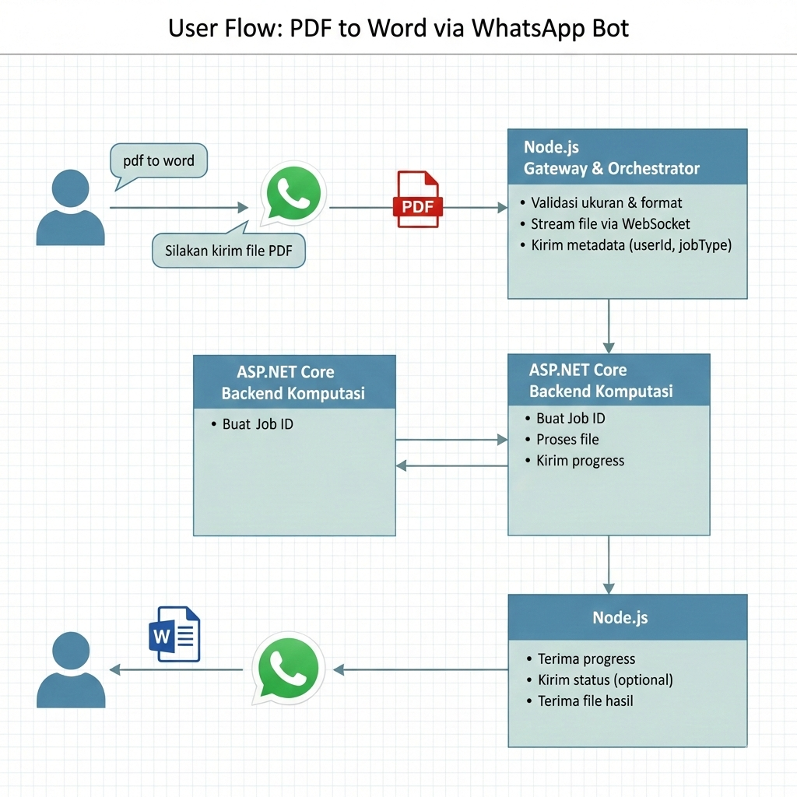
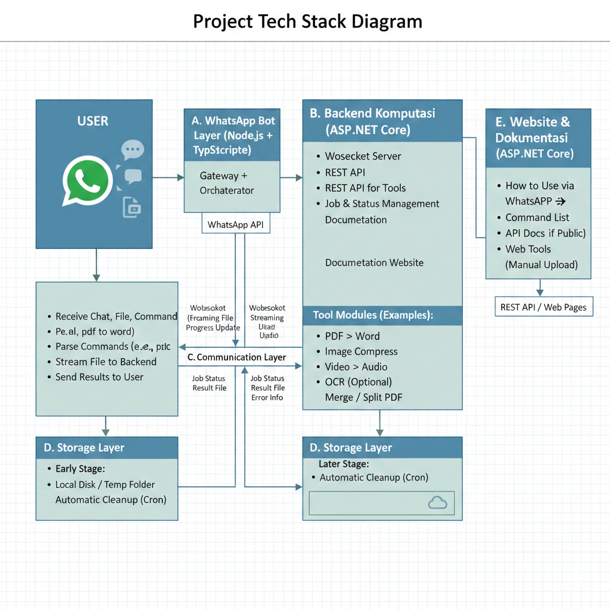

# WhatsApp Tools: Solusi Alat Produktifitas Buildin WhatsApp

Pernahkah Anda merasa repot harus membuka browser, mencari website konverter, dan melewati deretan iklan hanya untuk mengubah PDF ke Word atau mengompres gambar?

Saya sedang mengembangkan solusi yang menghilangkan hambatan tersebut: sebuah WhatsApp Tools Ecosystem yang memungkinkan pengguna melakukan tugas-tugas “mainstream” langsung dari aplikasi chat yang mereka gunakan setiap hari.

---

## 1) Gambaran Besar Produk

### Konsep utama
User berinteraksi **hanya lewat WhatsApp chat**, tanpa:

- Buka website
- Upload manual ke web
- Login

WhatsApp = UI utama  
Website ASP.NET Core = pendukung (docs, API, alternatif tool)

---

## 2) Komponen Utama Sistem

### A. WhatsApp Bot Layer (Node.js + TypeScript)
**Fungsi utama:**
- Terima chat, file, dan command dari user
- Parsing perintah (mis. `pdf to word`, `compress image`, dll.)
- Streaming file ke backend komputasi
- Kirim hasil kembali ke user via WhatsApp

**Kenapa Node.js cocok di sini:**
- Library WhatsApp ilegal mayoritas mature di Node
- Streaming file besar lebih natural
- Event-based cocok untuk chat system
- Node.js **TIDAK** melakukan processing berat

Node.js = Gateway + Orchestrator

### B. Backend Komputasi (ASP.NET Core)
**Fungsi utama:**
- Core processing engine
- WebSocket server
- REST API untuk tools
- Manajemen job & status
- Website dokumentasi

**Contoh modul tools:**
- PDF → Word
- Image Compress
- Video → Audio
- OCR (opsional)
- Merge / Split PDF

### C. Communication Layer
**Dua jalur komunikasi:**
- Node.js → ASP.NET Core  
  - WebSocket (utama)  
  - Streaming file  
  - Progress update
- ASP.NET Core → Node.js  
  - Job status  
  - File hasil  
  - Error info

### D. Storage Layer
Tergantung skala.

**Tahap awal:**
- Local disk / temp folder
- Cleanup otomatis (cron)

### E. Website & Dokumentasi (ASP.NET Core)
**Isi website:**
- Cara pakai via WhatsApp
- Daftar command
- Contoh chat
- API docs (jika nanti public)
- Alternatif web tools (manual upload)

Website tidak wajib untuk penggunaan utama, tapi penting untuk:
- Edukasi user
- SEO
- Trust

---

## 3) Alur Penggunaan (User Flow)

### Contoh: PDF → Word
1. User chat ke WhatsApp Bot: `pdf to word`
2. Bot membalas: “Silakan kirim file PDF”
3. User kirim PDF
4. Node.js:
- Validasi ukuran & format
- Stream file ke ASP.NET Core via WebSocket
- Kirim metadata (userId, jobType)
5. ASP.NET Core:
- Buat Job ID
- Proses file
- Kirim progress ke Node.js
6. Node.js:
- Kirim status ke user (optional)
- Terima file hasil
- Bot kirim file Word ke user

### Diagram user flow


---

## 4) Diagram Arsitektur (High-Level)

```text
┌──────────────┐
│   WhatsApp   │
│    User      │
└──────┬───────┘
       │ Chat / File
       ▼
┌────────────────────┐
│ WhatsApp Bot       │
│ Node.js + TS       │
│ (Illegal Library)  │
└──────┬─────────────┘
       │ WebSocket / Stream
       ▼
┌──────────────────────────┐
│ ASP.NET Core Backend     │
│                          │
│ - Tool Engine            │
│ - Job Manager            │
│ - WebSocket Server       │
│ - REST API               │
└──────┬───────────────┬───┘
       │               │
       ▼               ▼
┌──────────────┐   ┌──────────────┐
│ Temp Storage │   │ Documentation│
│ / Object     │   │ Website      │
│ Storage      │   │ ASP.NET Core │
└──────────────┘   └──────────────┘
```

### Diagram tech stack


---

## 5) Alur Pengembangan Bertahap (Roadmap)

### Phase 1 – MVP (Wajib Stabil)
Target: Tools benar-benar jalan
- WhatsApp Bot (1–2 tools)
- WebSocket streaming Node → .NET
- 1 tool processing (misalnya PDF → Word)
- Hard limit ukuran file
- Manual cleanup file  
✅ Fokus: fungsi > skalabilitas

### Phase 2 – Reliability
Target: Siap dipakai banyak user
- Job queue (in-memory / Redis)
- Timeout & retry
- Progress update ke user
- Error handling rapi
- Logging terstruktur

### Phase 3 – Scale & Safety
Target: Siap tumbuh
- Object storage
- Rate limiting per user
- Worker pool
- Sandbox processing (isolation)
- Optional auth token internal

### Phase 4 – Monetization / Compliance
Target: Siap pivot
- Freemium limit
- Premium tools
- API public
- Opsi migrasi ke WhatsApp Official API

---

## 6) Risiko & Mitigasi (Penting)

### ⚠️ Library WhatsApp Ilegal
**Risiko:**
- Nomor diblokir
- Breaking update
- Legal compliance

**Mitigasi:**
- Abstraction layer di Node.js
- Jangan hard-couple business logic ke library
- Siapkan adapter untuk API resmi di masa depan

### ⚠️ File Besar & Abuse
- Limit ukuran
- Auto delete
- Rate limit
- Virus scan (opsional)

---

## 7) Kenapa Arsitektur Ini Bagus
- Node.js fokus ke chat & streaming
- ASP.NET Core fokus ke komputasi & API
- Mudah diskalakan
- Mudah diganti WhatsApp layer-nya
- Website & tool satu ekosistem
